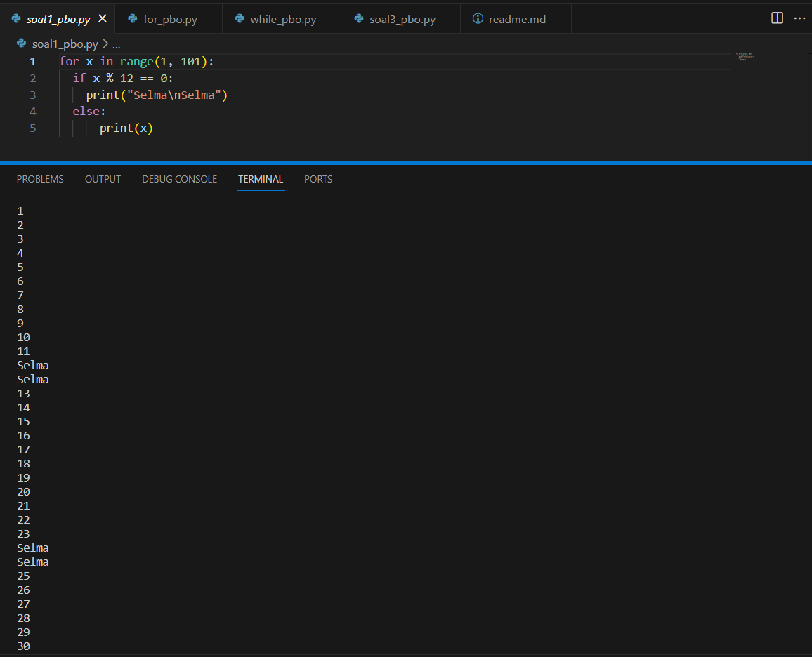
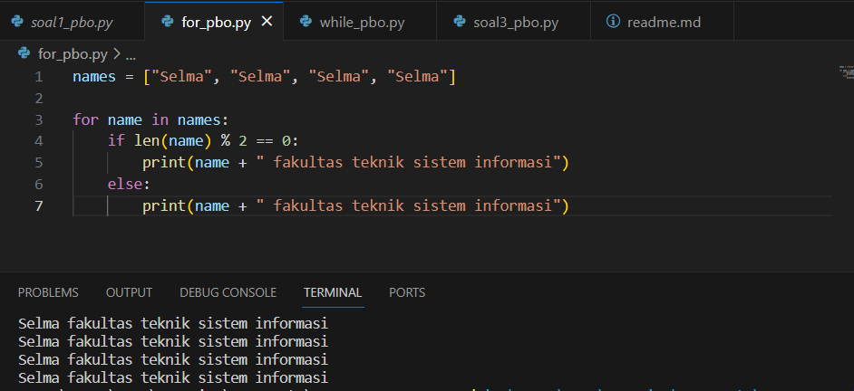
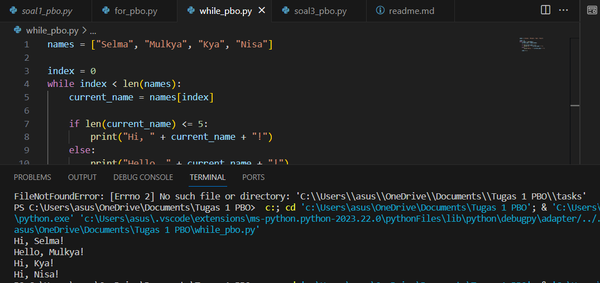
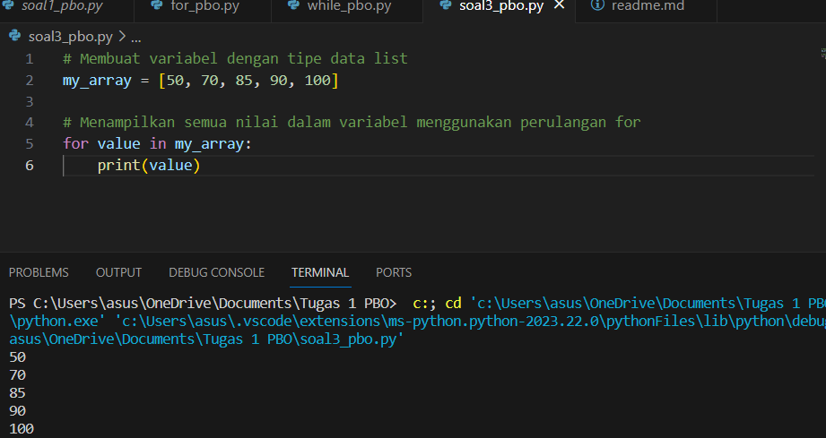

# Tugas 1 PBO

1. Buatlah perulangan hingga 100 menggunakan Python 
2. Buatlah program bebas, dengan menerapkan if else pada:
  a. For Loops
  b. While Loops

 3. Buatlah sebuah variabel dengan tipe data array, kemudian tampilkan semua nilai dalam variabel tersebut menggunakan perulangan for

 # Penjelasan

  Buatlah perulangan hingga 100 menggunakan Python 


1. 


Pada gambar diatas merupakan code beserta output nya. Perulangan menggunakan python sesuai dengan tugas yang telah diberikan. "for x in range(1, 101)" Ini adalah perulangan for yang akan mengiterasi variabel x melalui nilai-nilai dari 1-100.
"if x % 12 == 0" Ini adalah pernyataan kondisional (if) yang memeriksa apakah nilai x adalah kelipatan dari 12. Operasi % digunakan untuk mendapatkan sisa bagi dari pembagian x dengan 12. (n) pada Selma berguna untuk memisahkan selma dari satu baris agar tidak bersambung. "else" bagian ini akan dijalankan jika kondisi pada if tidak terpenuhi.

2. 


Pada gambar diatas merupakan program yang menerapkan if else pada for loops. "names = ["Selma", "Selma", "Selma", "Selma"]. Ini adalah sebuah list yang berisi empat elemen dengan nama "Selma". "for name in names" ini adalah perulangan for yang mengliterasi melalui setiap elemen dalam list names. Pada setiap literasi, elemen saat ini disimpan dalam variabel name. "if len(name) % 2 == 0" ini adalah pernyataan kondisional (if) yang memeriksa apakah panjang nama (jumlah karakter) dalam variabel name adalah bilangan genap. Operasi % digunakan untuk mendapatkan sisa bagi dari panjang nama dibagi 2. "print(name + " fakultas teknik sistem informasi")" pesan dengan format "fakultas teknik sistem informasi" akan dicetak. 




"if len(current_name) <= 5" Pernyataan kondisional yang memeriksa apakah panjang nama (len(current_name)) kurang dari atau sama dengan 5. Apabila kurang dari 5 maka output yang dihasil yaitu "Hi", jika lebih dari 5 maka ouput akan menghasilkan "Hello". "while index < len(names)" ini adalah loop while yang akan terus berjalan selama index kurang dari panjang list names.
"current_name = names[index]" membaca nama saat ini dalam list names sesuai dengan indeks saat ini dan menyimpannya dalam variabel current_name.

3. 


"my_array = [50, 70, 85, 90, 100]" baris ini membuat variabel yang saya beri nama "my_array" lalu menginisialisasinya dengan sebuah list yang berisikan dengan nilai numerik. "for value in my_array:
    print(value)" for disini berguna untuk mengiterasi tiap nilai yang ada didalam list my_array. Lalu kita gunakan "print(value) untuk memanggil nilainya.


# Run Locally

Clone the project

```bash
  git clone https://github.com/selma055/selma-mulkya
```